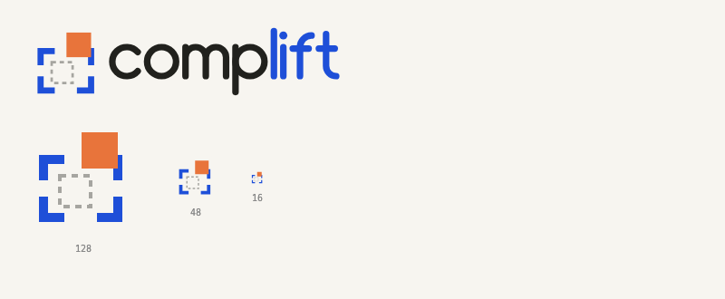
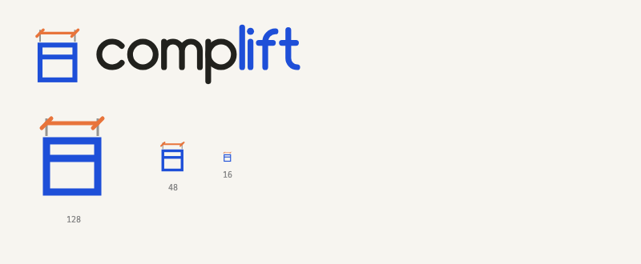
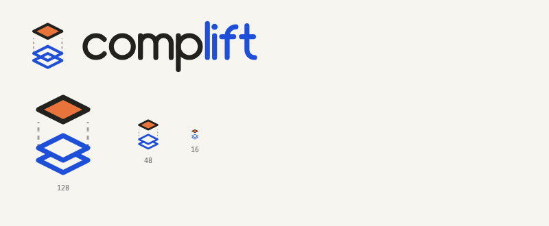

# complift · Logo 方向稿

> 2026-06-12 · huashu-design 品牌工作流产出。品牌语境对齐选定 UI 方向 **Drafting Bench / 制图台**（见 `docs/design.md` §5）：工程制图、精确、可度量。
>
> 色板：钴蓝 `#1E4FD8` · 安全橙 `#E8743B` · 墨黑 `#21211D` · 纸白 `#F7F5F0`
>
> 字标为自绘 monoline 路径（制图笔触感，不依赖任何字体），`comp` 墨黑 + `lift` 钴蓝，全部 SVG 自包含、无外部素材。

横向对照：`.agent/jobs/logo-design/contact-sheet.png`

每方向交付：`logo.svg`（主标 lockup，透明底 444×100）· `icon.svg`（128×128 方形，可作扩展图标，16/48/128 已验证可辨）· `preview.png`（playwright 渲染）

---

## Direction 1 · Lift-off（选取与拎起）

**概念**：四角选取框（钴蓝 marquee bracket）+ 虚线"原位"幽灵框 + 被拎到右上方的实心橙色组件方块。直接图解产品的核心动作——*在页面上框选一个元素，把它 lift 出来*。虚线幽灵框暗示"组件离开了原页面但原页面无损"，与 onion-skin 对比功能呼应。

**适用判断**：三案中叙事性最强、最贴产品交互本身；16px 下橙块 + 角标仍可辨。若只选一个方向作扩展图标，推荐此案。

## Direction 2 · Dimension Callout（被度量的组件）

**概念**：把"组件"画成一张工程图详图——钴蓝方框是组件卡片（贯通横线为卡片分区），上方安全橙尺寸标注线配 45° 制图斜刻度（drafting slash，比箭头更"手工制图"），细墨色延伸线半透明。直接挪用 Drafting Bench UI 里 stage 四周的尺寸标注语言，品牌一致性最高。

**适用判断**：气质最"精确/可度量"，与 mockup 的标尺刻度视觉完全同源；概念上偏静态（讲"度量"不讲"lift"）。

## Direction 3 · Layer Peel（从页面层抬离）

**概念**：等距视角的层堆——下方两层钴蓝描线菱形代表原页面的 DOM 层，最上方安全橙实心层（墨色描边）被垂直抬离，虚线升降导线连接原位。结构隐喻：组件是从页面分层结构中完整剥离出来的一"层"。几何族（等距 2.5D）与前两案（平面正交）完全不同。

**适用判断**：形最独特、远观识别度最高（实心橙菱形 + 蓝色层堆）；与 UI 的平面制图语言略有距离，更像独立品牌符号。

---

## 使用说明

- `logo.svg` 透明底，置于纸白/白底使用；暗底（如 `#21211D`）需要反白变体时另出（墨黑笔画换纸白即可，结构不变）。
- `icon.svg` 自带纸白圆角底板（rx=24），可直接作 Chrome 扩展 128/48/16 图标源文件缩放导出。
- 不要给图形加渐变、阴影、外发光；色板内取色，不发明新色。
